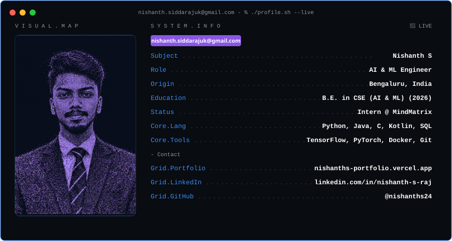

<div align="center">

  

<!-- Dynamic Typing SVG -->
<a href="https://git.io/typing-svg"></a>

<br/>

**🚀 Android App Development using GenAI Intern @ Mindmatrix**

<br/>

<a href="https://nishanths-portfolio.vercel.app/"></a>

</div>

<br/>

<!-- ═══════════════════════════════════════════════════════ -->

## 🧑‍💼 About Me

> Aspiring AI & ML Engineer with a strong foundation in Deep Learning, Python, and GenAI. Currently working as an Android App Development Intern at Mindmatrix, integrating AI into mobile applications. Passionate about building robust machine learning models and intelligent applications.

```yaml
🎓 Education    : B.E. Computer Science (AI & ML) — VTU (Graduating 2026)
🔬 Current Role : Android App Development using GenAI Intern @ Mindmatrix
🧠 Focus Areas  : Deep Learning · GenAI · Mobile AI · Data Science
🌍 Location     : Bengaluru, India
📫 Contact      : nishanth.siddarajuk@gmail.com
🌐 Portfolio    : https://nishanths-portfolio.vercel.app/
```

<br/>

<!-- ═══════════════════════════════════════════════════════ -->

## 💼 Professional Experience

<table>
<tr>
<td width="100" align="center">
  
  <br/><sub><b>Mindmatrix</b></sub>
</td>
<td>

### Android App Development using GenAI - Intern
**Mindmatrix, Bengaluru, India** · *Feb 2026 – May 2026*
- Built and tested AI-powered Android application features using Kotlin and Android Studio.
- Boosted app responsiveness by 20% through debugging, REST API integration, and Kotlin UI optimization.

</td>
</tr>
</table>

<br/>

<!-- ═══════════════════════════════════════════════════════ -->

## 🚀 Featured Projects

<table>
<tr>
<td width="50%" valign="top">

### 📈 [Stock Market Analysis Using AI](https://github.com/nishanths24/EquiNexa-AI)
Engineered an AI-driven stock market prediction system in Python, improving trend-prediction accuracy by 15%. Built and evaluated machine learning models using technical indicators.

`Python` `Machine Learning` `Matplotlib`

</td>
<td width="50%" valign="top">

### 🛡️ [DefendAI — Deepfake Detection](https://github.com/nishanths24/DefendAI)
An AI-powered deepfake detection platform that analyzes uploaded images using a ResNet18 deep-learning classifier and an input integrity/anomaly detection layer.

`Next.js` `FastAPI` `PyTorch` `ResNet18`

</td>
</tr>
<tr>
<td width="50%" valign="top">

### 📱 [Namma Platform - GenAI App](https://github.com/nishanths24/Namma_Platform)
Built a Kotlin-based Android application with Retrofit API and XML UI, delivering real-time train schedules. Integrated Kannada language support.

`Kotlin` `Android Studio` `Generative AI`

</td>
<td width="50%" valign="top">

### 💬 [RAG PDF Chatbot](https://github.com/nishanths24/RAG-PDF-Chatbot)
AI-powered multi-document RAG chatbot for querying PDF files with semantic retrieval, FAISS, local embeddings, and Groq-powered responses.

`Python` `LangChain` `FAISS` `Groq` `PyTorch`

</td>
</tr>
</table>

<br/>

<!-- ═══════════════════════════════════════════════════════ -->

## 🛠️ Skills & Technologies

<div align="center">
  <a href="https://skillicons.dev">
    
  </a>
</div>

<br/>

<!-- ═══════════════════════════════════════════════════════ -->

## 🏆 Certifications

- **Programming in Python** — Meta, Coursera
- **Introduction to Artificial Intelligence (AI)** — IBM

<br/>

<!-- ═══════════════════════════════════════════════════════ -->

## 📈 GitHub Stats

<div align="center">
  
  
</div>

<div align="center">
  
</div>
